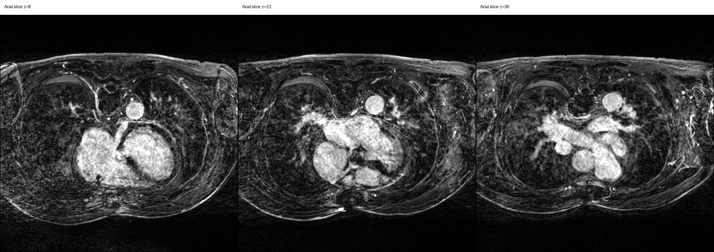

# BiAtria-LGE 100

## A Multi-Centre 3D LGE-MRI Dataset for Bi-Atrial Wall and Cavity Segmentation in Atrial Fibrillation


**[BiAtria-LGE 100](https://auckland.figshare.com/articles/dataset/_b_BiAtria-LGE_100_Dataset_b_/33148751)** is a curated multi-centre cardiac magnetic resonance imaging dataset for automated segmentation of the left and right atrial walls and cavities.

The dataset contains **100 paired three-dimensional late gadolinium enhancement magnetic resonance imaging volumes and corresponding multi-class segmentation masks**.

| Cohort | Image-mask pairs | Intended role |
|---|---:|---|
| Utah | 91 | Development and held-out testing |
| Waikato | 9 | Cross-cohort or external evaluation |
| **Total** | **100** | |

- **Format:** compressed NIfTI, `.nii.gz`
- **Segmentation task:** four foreground anatomical classes plus background
- **Approximate Figshare download size:** 1.39 GB
- **Recommended use:** non-clinical research and method development




*Representative axial slices from `Utah_image_0090.nii.gz`. Robust intensity clipping was used for display only.*


## ⚠️ License and Citation Requirements

>Please read the following terms carefully before downloading or using any contents of this repository. By using this data, you agree to these terms.

### License and Usage Restrictions

>We welcome the use of this data to test AI approaches. However, using the data or labels for commercialization or other purposes is strictly prohibited. Any other uses require contacting the team to obtain written permission.

### Mandatory Citation Policy

>Anyone using this data for training, testing, or publishing articles must include the correct citation. Failure to provide proper citation is a serious violation of our terms of use, and the authors hold no responsibility or liability for any academic, legal, or other consequences that result. Resharing this data or uploading it to third party sites is strictly prohibited.

## Table of contents

- [Dataset composition](#dataset-composition)
- [Segmentation labels](#segmentation-labels)
- [Directory structure](#directory-structure)
- [Metadata](#metadata)
- [Quick start](#quick-start)
- [Read a NIfTI image and label](#read-a-nifti-image-and-label)
- [Read and query the metadata](#read-and-query-the-metadata)
- [Visualise an image and segmentation](#visualise-an-image-and-segmentation)
- [Recommended evaluation protocol](#recommended-evaluation-protocol)
- [Intended and future uses](#intended-and-future-uses)
- [Known limitations](#known-limitations)
- [Ethics and responsible use](#ethics-and-responsible-use)
- [Citation](#citation)

---

## Dataset composition

### Utah cohort

The Utah cohort contains **91 paired LGE-MRI images and segmentation masks from 38 de-identified patients**.

The cohort contains longitudinal examinations acquired at the following relative timepoints:

- pre-treatment;
- 3 months;
- 4 months;
- 6 months;
- 7 months;
- 8 months;
- 9 months;
- 11 months.

The supplied split is defined at the patient level.

| Utah partition | Patients | Image-mask pairs |
|---|---:|---:|
| Training | 31 | 73 |
| Test | 7 | 18 |
| **Total** | **38** | **91** |

**Training patients:** `patient_ID_005` to `patient_ID_035`

**Test patients:** `patient_ID_001` to `patient_ID_004`, and `patient_ID_036` to `patient_ID_038`

No patient appears in both Utah partitions.

### Waikato cohort

The Waikato cohort contains **nine paired LGE-MRI images and segmentation masks**.

The cohort may be used for cross-cohort or external evaluation. Researchers must clearly state whether Waikato data influenced:

- training;
- preprocessing selection;
- hyperparameter tuning;
- model selection;
- threshold selection;
- calibration;
- adaptation;
- final evaluation.


### Image geometry

Observed or reported geometries include:

| Property | Value |
|---|---|
| Common matrix size | `640 x 640 x 44` voxels |
| Additional Utah matrix size | `576 x 576 x 44` voxels |
| Reported voxel spacing | `0.625 x 0.625 x 2.5 mm` |


---

## Segmentation labels

| Voxel value | Anatomical structure |
|---:|---|
| 0 | Background |
| 1 | Right atrial wall |
| 2 | Left atrial wall |
| 3 | Right atrial cavity |
| 4 | Left atrial cavity |

Valid label values:

```python
VALID_LABELS = {0, 1, 2, 3, 4}
```


---

## Directory structure


```text
Bi_Atrial_Segmentation_Data/
├── Utah/
│   ├── images/
│   │   ├── Utah_image_0001.nii.gz
│   │   └── ...
│   └── labels/
│       ├── Utah_label_0001.nii.gz
│       └── ...
├── Waikato/
│   ├── images/
│   │   ├── Waikato_image_0001.nii.gz
│   │   └── ...
│   └── labels/
│       ├── Waikato_label_0001.nii.gz
│       └── ...
└── patient_image_mapping.csv
```


---

## Metadata

The supplied Utah mapping file contains:

| Column | Description |
|---|---|
| `patient_ID` | De-identified patient identifier |
| `image_taken` | Relative acquisition timepoint, for example `pre`, `3mo`, or `11mo` |
| `image_ID` | Image identifier without `.nii.gz` |
| `label_ID` | Label identifier without `.nii.gz` |
| `Split` | Supplied patient-level partition, `Train` or `Test` |

Example:

```csv
patient_ID,image_taken,image_ID,label_ID,Split
patient_ID_001,pre,Utah_image_0001,Utah_label_0001,Test
patient_ID_001,3mo,Utah_image_0002,Utah_label_0002,Test
patient_ID_005,pre,Utah_image_0013,Utah_label_0013,Train
```

The current mapping file describes the Utah cohort. Waikato rows should be added to a future metadata release when patient-level mapping can be shared.

<!-- ---

## Installation

Create and activate a virtual environment:

```bash
python -m venv .venv
```

Linux or macOS:

```bash
source .venv/bin/activate
```

Windows PowerShell:

```powershell
.venv\Scripts\Activate.ps1
```

Install dependencies:

```bash
python -m pip install --upgrade pip
python -m pip install -r requirements.txt
```

--- -->

## Quick start

Set the path to the extracted dataset:

```python
from pathlib import Path

DATA_ROOT = Path("/path/to/Bi_Atrial_Segmentation_Data")
METADATA_PATH = DATA_ROOT / "patient_image_mapping.csv"

assert DATA_ROOT.exists(), f"Dataset directory not found: {DATA_ROOT}"
assert METADATA_PATH.exists(), f"Metadata file not found: {METADATA_PATH}"
```

---

## Read a NIfTI image and label

```python
from pathlib import Path

import nibabel as nib
import numpy as np

DATA_ROOT = Path("/path/to/Bi_Atrial_Segmentation_Data")

image_path = DATA_ROOT / "Utah" / "images" / "Utah_image_0090.nii.gz"
label_path = DATA_ROOT / "Utah" / "labels" / "Utah_label_0090.nii.gz"

image_nifti = nib.load(str(image_path))
label_nifti = nib.load(str(label_path))

image = image_nifti.get_fdata(dtype=np.float32)
label = np.asarray(label_nifti.dataobj, dtype=np.uint8)

print("Image shape:", image.shape)
print("Label shape:", label.shape)
print("Image dtype:", image.dtype)
print("Label dtype:", label.dtype)
print("Voxel spacing:", image_nifti.header.get_zooms()[:3])
print("Orientation:", nib.aff2axcodes(image_nifti.affine))
print("Label values:", np.unique(label))
```

Validate the image-label pair:

```python
if image.shape != label.shape:
    raise ValueError(
        f"Shape mismatch: image={image.shape}, label={label.shape}"
    )

if not np.allclose(image_nifti.affine, label_nifti.affine, atol=1e-5):
    raise ValueError("Image and label affine matrices do not match.")

observed_labels = set(np.unique(label).tolist())
valid_labels = {0, 1, 2, 3, 4}

if not observed_labels.issubset(valid_labels):
    raise ValueError(f"Unexpected label values: {sorted(observed_labels)}")
```


---

## Read and query the metadata

```python
from pathlib import Path

import pandas as pd

DATA_ROOT = Path("/path/to/Bi_Atrial_Segmentation_Data")

metadata = pd.read_csv(DATA_ROOT / "patient_image_mapping.csv")
metadata["Split"] = metadata["Split"].str.strip().str.lower()
metadata["image_taken"] = metadata["image_taken"].str.strip().str.lower()

print(metadata.head())
```

Count scans and patients by split:

```python
print(metadata.groupby("Split").size())
print(metadata.groupby("Split")["patient_ID"].nunique())
```

Expected Utah counts:

```text
train: 73 scans from 31 patients
test: 18 scans from 7 patients
```

List all examinations for one patient:

```python
patient_id = "patient_ID_001"

patient_rows = (
    metadata.loc[metadata["patient_ID"] == patient_id]
    .sort_values("image_taken")
    .reset_index(drop=True)
)

print(patient_rows)
```

---

## Visualise an image and segmentation

```python
import matplotlib.pyplot as plt
import numpy as np

labelled_voxels_per_slice = np.count_nonzero(label, axis=(0, 1))
z_index = int(np.argmax(labelled_voxels_per_slice))

image_slice = np.rot90(image[:, :, z_index])
label_slice = np.rot90(label[:, :, z_index])

foreground = image_slice[image_slice > 0]
display_min, display_max = np.percentile(foreground, [1.0, 99.5])

masked_label = np.ma.masked_where(label_slice == 0, label_slice)

plt.figure(figsize=(8, 8))
plt.imshow(
    image_slice,
    cmap="gray",
    vmin=display_min,
    vmax=display_max,
)
plt.imshow(
    masked_label,
    cmap="tab10",
    alpha=0.45,
    vmin=0,
    vmax=4,
)
plt.title(f"Image and segmentation overlay, z={z_index}")
plt.axis("off")
plt.tight_layout()
plt.show()
```


<!-- ## Validate the dataset

The audit script checks:

- required metadata columns;
- duplicate image and label identifiers;
- patient leakage between supplied partitions;
- missing image or label files;
- unreadable NIfTI files;
- image-label shape mismatches;
- affine mismatches;
- unexpected label values.


---

## Create a patient-level validation split

Create validation data only from the supplied Utah training patients.

```python
import pandas as pd
from sklearn.model_selection import GroupShuffleSplit

metadata = pd.read_csv("patient_image_mapping.csv")
metadata["Split"] = metadata["Split"].str.strip().str.lower()

development = metadata.loc[
    metadata["Split"] == "train"
].reset_index(drop=True)

splitter = GroupShuffleSplit(
    n_splits=1,
    test_size=0.20,
    random_state=42,
)

train_indices, validation_indices = next(
    splitter.split(
        development,
        groups=development["patient_ID"],
    )
)

training_metadata = development.iloc[train_indices]
validation_metadata = development.iloc[validation_indices]

assert set(training_metadata["patient_ID"]).isdisjoint(
    set(validation_metadata["patient_ID"])
)
```

Different timepoints from the same patient must not be divided across training, validation, test, calibration, or cross-validation partitions.

---

## PyTorch example

A reusable 3D PyTorch dataset is included in:

```text
examples/pytorch_dataset.py
```

Basic use:

```python
from pathlib import Path

import pandas as pd
from torch.utils.data import DataLoader

from examples.pytorch_dataset import BiAtriaLGE3DDataset

data_root = Path("/path/to/Bi_Atrial_Segmentation_Data")
metadata = pd.read_csv(data_root / "patient_image_mapping.csv")
metadata["Split"] = metadata["Split"].str.strip().str.lower()

training_rows = metadata.loc[metadata["Split"] == "train"]

dataset = BiAtriaLGE3DDataset(
    metadata=training_rows,
    data_root=data_root,
)

loader = DataLoader(
    dataset,
    batch_size=1,
    shuffle=True,
    num_workers=4,
    pin_memory=True,
)

batch = next(iter(loader))

print(batch["image"].shape)
print(batch["label"].shape)
```

The original in-plane dimensions are large. Full-volume 3D training may require patch sampling, mixed precision, gradient accumulation, or batch size 1.

--- -->


## Recommended evaluation protocol

1. Use the supplied Utah training partition for model development.
2. Create validation folds only from Utah training patients.
3. Keep the supplied Utah test patients completely held out.
4. Use Waikato for external evaluation only when it has not influenced development.

---

## Intended and future uses

The dataset may support:

- supervised 2D and 3D segmentation;
- atrial wall and cavity segmentation;
- transfer learning;
- domain adaptation and domain generalisation;
- cross-cohort robustness evaluation;
- longitudinal analysis;
- uncertainty quantification;
- probability calibration;
- automated segmentation quality control;
- failure detection;
- out-of-distribution detection;
- few-shot learning;
- active learning;
- self-supervised representation learning;
- test-time adaptation;
- cardiac segmentation benchmarking.

Potential automated quality-control tasks include detection of:

- missing anatomical classes;
- anatomically implausible masks;
- disconnected components;
- excessive false positives;
- wall-cavity label reversal;
- segmentation leakage;
- empty masks;
- unusual segmented volumes;
- low-confidence predictions.

---

## Known limitations

- The Utah cohort is substantially larger than the Waikato cohort.
- The Waikato cohort contains only nine image-mask pairs.
- The Utah cohort contains repeated examinations from some patients.
- Follow-up timepoints are not uniform across patients.
- More than one in-plane matrix size is present.
- Intensity scale and data type may vary across images or cohorts.
- The dataset does not represent every scanner, site, protocol, population, or disease presentation.
- Statistical analyses must account for repeated observations.
- Subgroup analysis may be limited by available metadata.
- Annotation variability may not be fully characterised.
- The current mapping file describes the Utah cohort.
- Performance on this dataset does not establish clinical validity.

---

## Ethics and responsible use

The dataset must be treated as de-identified human research data.

Users must not:

- attempt participant re-identification;
- link dataset identifiers to external identifiable records;
- redistribute data outside the applicable licence or agreement;
- use the data for direct clinical decision-making without independent validation;
- present a model as clinically validated solely because it performs well on this dataset.

Clinical use requires independent external validation, site-specific evaluation, governance review, human oversight, and regulatory assessment where applicable.

---

## Citation

Researchers using this dataset must cite:

1. the BiAtria-LGE 100 Figshare dataset record;
2. the associated TASSNet publication listed under the Figshare record's related materials.


### BibTeX template

```bibtex
@article{Gunawardhana2026,
  author = {Malitha Gunawardhana and Gregory Sands and Mark Trew and Jichao Zhao},
  title  = {BiAtria-LGE 100 Dataset},
  year   = {2026},
  month  = {9},
  url    = {https://auckland.figshare.com/articles/dataset/_b_BiAtria-LGE_100_Dataset_b_/33148751},
  doi    = {10.17608/k6.auckland.33148751.v1}
}
```

Associated publication:

> **Gunawardhana, Malitha, et al. "TASSNet: A Deep Learning Framework for Robust Bi-Atrial Segmentation for Assessing Structural Basis of Atrial Fibrillation." International Workshop on Statistical Atlases and Computational Models of the Heart. Cham: Springer Nature Switzerland, 2025.**


